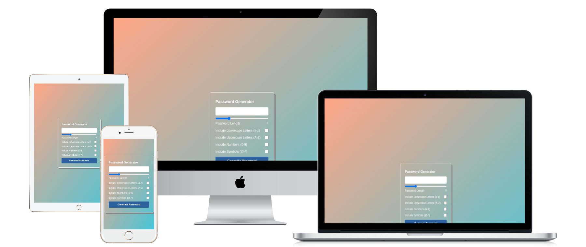

  

# Password-Generator

The Password Generator is a web application designed to help users create strong, secure, and customizable passwords. Built with an emphasis on user experience and visual appeal, this tool generates passwords based on user-defined criteria such as length and character types. Whether you're looking to create a password for a new account or enhance the security of your existing ones, this project offers a simple and effective solution.

## Table of contents

  - [Features](#features)
  - [Getting Started](#getting-started)
  - [Usage](#usage)
  - [Setup](#setup)
- [Overview](#overview)
  - [Links](#links)
  - [Technologies Used](#technologies-used)
- [My process](#my-process)
  - [Built with](#built-with)
  - [Continued development](#continued-development)
- [Live Demo](#-live-demo)
- [Author](#author)
- [Contributing](#-contributing)
- [Show your support](#show-your-support)
- [Acknowledgments](#acknowledgments)
- [License](#-license)

### Features

- **Customizable Password Length**:  Users can specify the length of the password, ranging from a minimum to a maximum number of characters, ensuring flexibility in the strength of the generated password.
  
- **Character Type Selection**:  You can choose from a variety of character types, including lowercase letters, uppercase letters, numbers, and special characters, to customize the password according to personal preferences or security requirements.
  
- **Strong Security**: The password generator ensures that the passwords generated are both secure and random, reducing the risk of common password vulnerabilities.
    
- **Clean, Modern Design**: The interface is sleek and intuitive, with user-friendly controls and a modern aesthetic that makes it easy for anyone to generate secure passwords.
  
- **Instant Results**: Once the user selects their preferred settings, the generated password is displayed immediately, ready to be copied and used.

### Getting Started

To get a local copy up and running follow these simple steps.

Prerequisites
VIsual Studio Code.
A Web Browser (preferably Brave)

### Setup

Clone the GitHub Repository

- git clone "https://github.com/RomeesaKamal/Password-Generator-.git"

### Usage

- Open the app in your browser.
- Select the password length using the slider.
- Choose which character types you want to include in the password (lowercase, uppercase, numbers, and special characters).
- Click the "Generate Password" button to create a password.

### Overview

This Calculator is a modern, responsive web application designed to perform basic arithmetic operations like addition, subtraction, multiplication, and division. Built with a focus on simplicity and usability, the calculator features an intuitive user interface that adapts seamlessly to different screen sizes.
Whether you're performing simple calculations on the go or solving everyday math problems, this calculator offers an easy-to-use tool with a polished design. With additional features like **light** and **dark mode** themes, users can customize the look of the app according to their preferences. 
The app is developed using **HTML**, **CSS**, and **JavaScript** to provide a smooth and interactive user experience. It makes use of the best CSS practices, including **CSS Grid** and **Flexbox**, to ensure an elegant, minimalist design that is both visually appealing and functional.

The app is designed to be fast, lightweight, and accessible, making it a practical tool for a wide range of users.

### Technologies Used

- **HTML5**: For structuring the page and ensuring accessibility across devices.
- **CSS3**: For styling and creating a responsive, visually appealing design.
- **JavaScript**: For implementing the password generation logic and interactive features.
- **Responsive Design**:The project is fully responsive, ensuring a smooth experience on desktops, tablets, and mobile devices.

### Links

- Solution URL: [solution URL here](https://github.com/RomeesaKamal/Password-Generator-)
- Live Site URL: [live site URL here](https://romeesakamal.github.io/Password-Generator-/)

## My process

### Built with

**HTML/CSS & JS best practices:** Correct use of tags, elements, properties and syntax.

**GitHub flow:** Correct use of Branches for deployment and features development.

### Continued Development

This project is continuously evolving, and the following improvements and features are planned for future releases:

- **Copy to Clipboard**: I plan to add a "Copy" button to allow users to instantly copy the generated password to their clipboard for convenience.
  
- **Save Passwords**: A feature to save generated passwords securely for future use.
  
- **Strength Indicator**: Visual feedback on the strength of the generated password based on selected criteria.

- **Dark Mode**:  A toggle for users who prefer a dark theme for better accessibility and reduced eye strain.

- **Localization**:  Support for multiple languages to make the application accessible to a global audience.

## 🌎 Live Demo:

- [Live Demo Link](https://romeesakamal.github.io/Password-Generator-/)

## Author

### 👤 **Romeesa Kamal**

- GitHub: [@kamalromeesa](https://github.com/RomeesaKamal/)
- Fronted Mentor: [@Romeesakamal](https://www.frontendmentor.io/profile/RomeesaKamal)
- Linkedin: [@Romeesakamal](https://www.linkedin.com/in/romeesa-kamal-7864b8342/)

## 🤝 Contributing

Contributions, issues, and feature requests are welcome!

Feel free to check the issues page.

## Show your support

Give a ⭐️ if you like this project!

## Acknowledgments

- Thanks to the [Mujeeb ur Rehman](https://github.com/Mujeeb4582/) for the great curriculum.
- Thanks to the Code Reviewer(s) for the insightful feedback.

## 📝 License

This project is MIT licensed.

_NOTE: we recommend using the [MIT license](https://choosealicense.com/licenses/mit/) - you can set it up quickly by [using templates available on GitHub](https://docs.github.com/en/communities/setting-up-your-project-for-healthy-contributions/adding-a-license-to-a-repository). You can also use [any other license](https://choosealicense.com/licenses/) if you wish._

